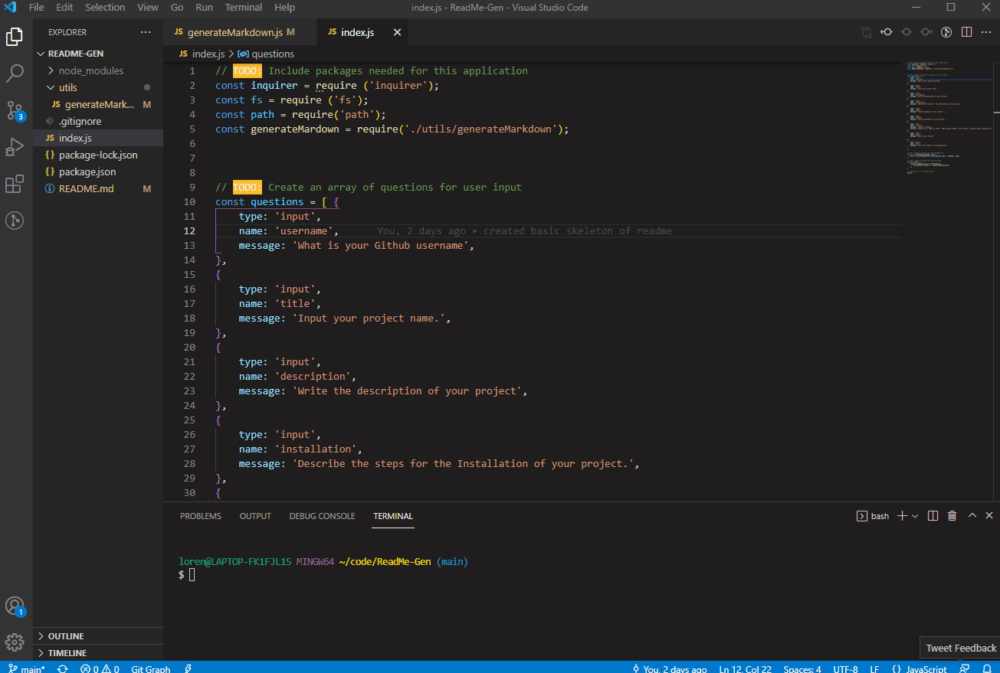

# ReadMe-Gen# Your Project Title

## Description 

When creating a repo through Github you need a quality README. 

The quality of a README often differentiates a good project from a bad project. A good one takes advantage of the opportunity to explain and showcase what your application does, justify the technologies used, and even talk about some of the challenges you faced and features you hope to implement in the future. A good README helps you stand out among the large crowd of developers putting their work on GitHub.
## Usage 


```md
GIVEN a command-line application that accepts user input
WHEN I am prompted for information about my application repository
THEN a high-quality, professional README.md is generated with the title of my project and sections entitled Description, Table of Contents, Installation, Usage, License, Contributing, Tests, and Questions
WHEN I enter my project title
THEN this is displayed as the title of the README
WHEN I enter a description, installation instructions, usage information, contribution guidelines, and test instructions
THEN this information is added to the sections of the README entitled Description, Installation, Usage, Contributing, and Tests
WHEN I choose a license for my application from a list of options
THEN a badge for that license is added near the top of the README and a notice is added to the section of the README entitled License that explains which license the application is covered under
WHEN I enter my GitHub username
THEN this is added to the section of the README entitled Questions, with a link to my GitHub profile
WHEN I enter my email address
THEN this is added to the section of the README entitled Questions, with instructions on how to reach me with additional questions
WHEN I click on the links in the Table of Contents
THEN I am taken to the corresponding section of the README
```


## Credits

https://github.com/lzvalentin